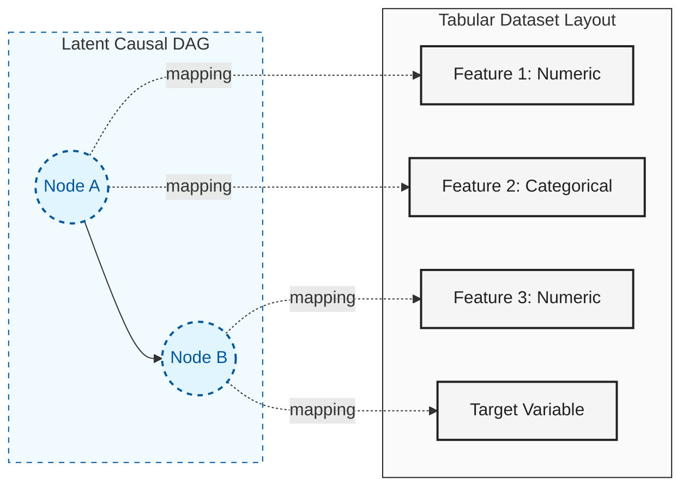

# dagzoo

High-throughput synthetic tabular data generation built around causal structure.
Use it to generate, benchmark, and stress-test tabular datasets with
deterministic seed behavior.


### From Latent DAG to Tabular Data

Unlike many generators that treat each column as an independent noise source, `dagzoo` generates data from a **latent causal structure**. A single node in the causal graph can branch into multiple observable features, preserving complex dependency patterns.



## Why dagzoo

`dagzoo` is for situations where you need synthetic tabular data that is:

- Causally structured: datasets are generated from a sampled latent DAG, not
  independent column noise.
- Reproducible: deterministic seed fan-out and effective-config trace artifacts
  make runs auditable.
- Stress-testable: shift, noise, missingness, and deferred filter controls let you probe
  model robustness under controlled distribution changes.
- Operationally scalable: canonical fixed-layout generation and benchmark
  guardrails support repeatable high-throughput workflows.

## Quick Start

Examples in this README assume a repo checkout (so `configs/*.yaml` is available):

```bash
uv sync --group dev
source .venv/bin/activate
./scripts/dev doctor all
```

Install the packaged CLI globally when you do not need repo presets/config files:

```bash
uv tool install dagzoo
```

Generate a default batch from the repo:

```bash
dagzoo generate --config configs/default.yaml --num-datasets 10 --out data/run1
```

Each generate run writes `effective_config.yaml` and `effective_config_trace.yaml`
in the resolved output directory.
`dagzoo generate` samples one internal fixed-layout plan per run, so all
datasets emitted in the same run share one sampled layout/execution plan.
Run `dagzoo filter` as a separate stage for acceptance decisions.
Deferred filtering now replays strictly from embedded shard metadata; generated
artifacts must include `metadata.config.dataset.task` and `metadata.config.filter`.
Generate configs must not include `runtime.worker_count` or
`runtime.worker_index`.

Run deferred filtering on generated shards:

```bash
dagzoo filter --in data/run1 --out data/run1_filter
```

Run a downstream handoff workflow from `generate`:

```bash
dagzoo generate --config configs/default.yaml --num-datasets 10 --handoff-root handoffs/run1 --device cpu --hardware-policy none
```

`dagzoo generate --handoff-root` writes one stable handoff root with:

- `handoff_manifest.json` as the downstream machine-readable entrypoint
- `generated/` for raw shard outputs plus effective-config artifacts

Run a smoke benchmark:

```bash
dagzoo benchmark --suite smoke --preset cpu --out-dir benchmarks/results/smoke_cpu
```

`--device` is a single-preset benchmark override. For multi-preset benchmark
runs, set the device in each preset/config instead of passing one shared CLI
override.

Inspect detected hardware tier:

```bash
dagzoo hardware
```

View help and available options for commands:

```bash
dagzoo --help
dagzoo generate --help
dagzoo filter --help
dagzoo benchmark --help
```

Local repo workflow before review:

```bash
./scripts/dev impact
./scripts/dev verify quick
```

## Documentation

Primary docs site:

- [https://bensonlee5.github.io/dagzoo/docs/](https://bensonlee5.github.io/dagzoo/docs/)

Start here for end-user workflows and contracts:

- [How It Works](https://bensonlee5.github.io/dagzoo/docs/how-it-works/): System flow and terminology.
- [Transforms (Math Reference)](https://bensonlee5.github.io/dagzoo/docs/transforms/): Formal transform math, notation, and operator definitions.
- [Usage Guide](https://bensonlee5.github.io/dagzoo/docs/usage-guide/): Primary workflow hub.
- [Output Format](https://bensonlee5.github.io/dagzoo/docs/output-format/): Output schema and artifacts.
- [Feature Guides](https://bensonlee5.github.io/dagzoo/docs/features/): Diagnostics, missingness, many-class, shift, noise, and benchmark guardrails.

If you are integrating `dagzoo` downstream, treat these as the stable
references:

- Handoff workflow and CLI usage: [Usage Guide](https://bensonlee5.github.io/dagzoo/docs/usage-guide/)
- Generated artifacts and handoff manifest schema: [Output Format](https://bensonlee5.github.io/dagzoo/docs/output-format/)
