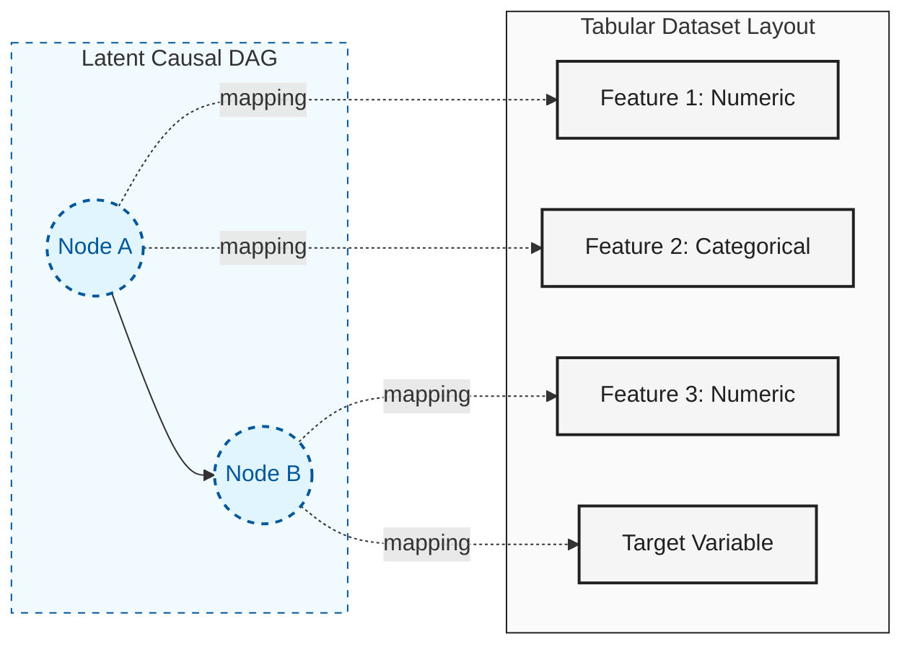

# dagzoo

High-throughput synthetic tabular data generation built around causal structure.
Use it to generate, benchmark, and stress-test tabular datasets with
deterministic seed behavior.

```mermaid
flowchart LR
    %% Class Definitions
    classDef setup fill:#e1f5fe,stroke:#01579b,stroke-width:2px,color:#01579b
    classDef core fill:#fff3e0,stroke:#e65100,stroke-width:2px,color:#e65100
    classDef gate fill:#f1f8e9,stroke:#33691e,stroke-width:2px,color:#33691e
    classDef out fill:#f3e5f5,stroke:#4a148c,stroke-width:2px,color:#4a148c

    Seed([Root Seed]) --> RNG[Deterministic Seeding]
    RNG --> Layout[Layout & DAG Sampling]
    Layout --> Mechanisms[Random Functional Mechanisms]
    Mechanisms --> Converters[Feature/Target Converters]
    Converters --> Filter[Learnability Filter]
    Filter --> Bundle[[DatasetBundle: X, y, Metadata]]

    %% Assign Classes
    class Seed,RNG setup
    class Layout,Mechanisms,Converters core
    class Filter gate
    class Bundle out
```



### From Latent DAG to Tabular Data

Unlike many generators that treat each column as an independent noise source, `dagzoo` generates data from a **latent causal structure**. A single node in the causal graph can branch into multiple observable features, preserving complex dependency patterns.



## Why dagzoo

`dagzoo` is for situations where you need synthetic tabular data that is:

- Causally structured: datasets are generated from a sampled latent DAG, not
  independent column noise.
- Reproducible: deterministic seed fan-out and effective-config trace artifacts
  make runs auditable.
- Stress-testable: shift, noise, missingness, and filter controls let you probe
  model robustness under controlled distribution changes.
- Operationally scalable: fixed-layout generation and benchmark guardrails
  support repeatable high-throughput workflows.

Recommended first reads after this README:

- [docs/how-it-works.md](docs/how-it-works.md): End-to-end runtime model and terminology.
- [docs/development/transforms.md](docs/development/transforms.md): Formal transform math, notation, and operator definitions.

## Quick Start

Examples in this README assume a repo checkout (so `configs/*.yaml` is available):

```bash
uv sync --group dev
source .venv/bin/activate
```

Install the packaged CLI globally when you do not need repo presets/config files:

```bash
uv tool install dagzoo
```

Generate a default batch from the repo:

```bash
dagzoo generate --config configs/default.yaml --num-datasets 10 --out data/run1
```

Each generate run writes `effective_config.yaml` and `effective_config_trace.yaml`
in the resolved output directory.

Run a smoke benchmark:

```bash
dagzoo benchmark --suite smoke --preset cpu --out-dir benchmarks/results/smoke_cpu
```

Inspect detected hardware tier:

```bash
dagzoo hardware
```

View help and available options for commands:

```bash
dagzoo --help
dagzoo generate --help
dagzoo benchmark --help
```

## Features

- Diagnostics: exposes per-dataset artifacts so you can verify coverage, inspect drift, and debug generation outcomes.
- Missingness (MCAR/MAR/MNAR): injects deterministic null patterns to evaluate models under realistic incomplete-data regimes.
- Fixed-layout batch generation: reuse one sampled layout across many datasets for easier high-throughput generation and analysis.
- Many-class workflows: stress-tests classification behavior near the current rollout envelope with stable preset and benchmark paths.
- Shift/drift controls: introduces interpretable graph/mechanism/noise drift for robustness and distribution-shift evaluation.
- Benchmark guardrails: provides repeatable runtime and metadata checks for local validation and CI-style regression gating.

## Documentation (End Users)

Next reads for end users:

- [docs/how-it-works.md](docs/how-it-works.md): System flow and terminology.
- [docs/development/transforms.md](docs/development/transforms.md): Formal mathematical specification of transforms.

Then explore features and workflows in the usage guide and feature docs:

- [docs/usage-guide.md](docs/usage-guide.md): Primary workflow hub.
- [docs/config-resolution.md](docs/config-resolution.md): Effective config precedence and trace artifacts.
- [docs/output-format.md](docs/output-format.md): Output schema and artifacts.
- Feature guides:
  [diagnostics](docs/features/diagnostics.md),
  [missingness](docs/features/missingness.md),
  [many-class](docs/features/many-class.md),
  [shift](docs/features/shift.md),
  [noise](docs/features/noise.md),
  [benchmark guardrails](docs/features/benchmark-guardrails.md)

## Codebase Navigation

The project is organized into functional modules that manage the lifecycle
of a synthetic dataset, from configuration and causal graph sampling to
node execution and quality filtering.

See [docs/development/codebase-navigation.md](docs/development/codebase-navigation.md)
for the full module map with file paths and descriptions.

## Python API

```python
from dagzoo import GeneratorConfig, generate_one

config = GeneratorConfig.from_yaml("configs/default.yaml")
bundle = generate_one(config, seed=42)
print(bundle.X_train.shape, bundle.y_train.shape)
```

For command-line and workflow details, use
[docs/usage-guide.md](docs/usage-guide.md).

## Roadmap and Development

- [docs/development/roadmap.md](docs/development/roadmap.md)
- [docs/development/backlog_decision_rules.md](docs/development/backlog_decision_rules.md)
- [docs/design-decisions.md](docs/design-decisions.md)
- [docs/development/codebase-navigation.md](docs/development/codebase-navigation.md)
- [reference/literature_evidence_2026.md](reference/literature_evidence_2026.md)
