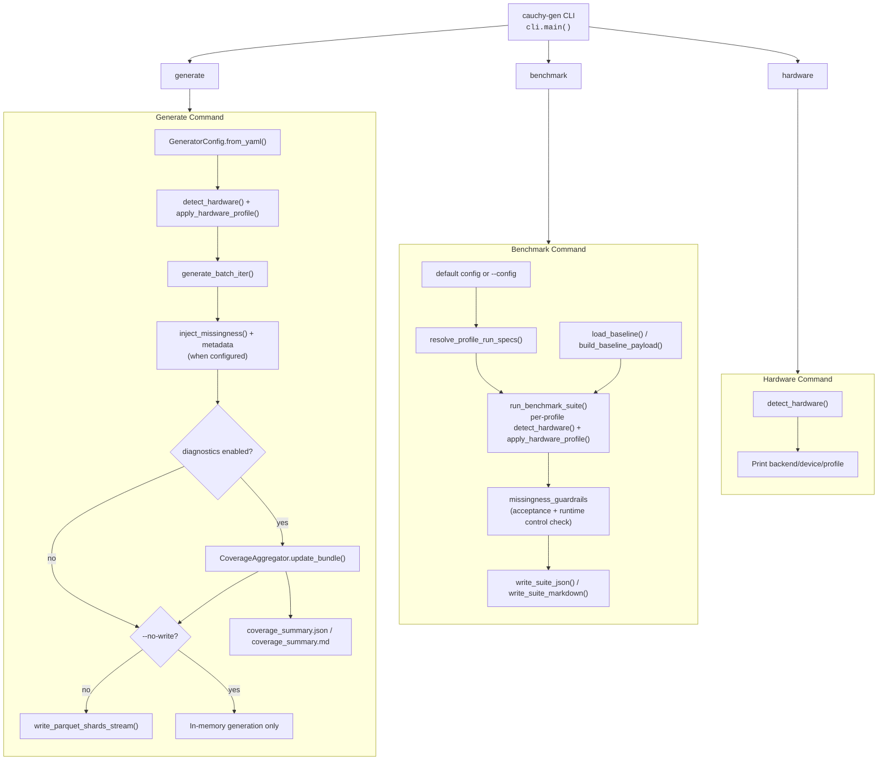
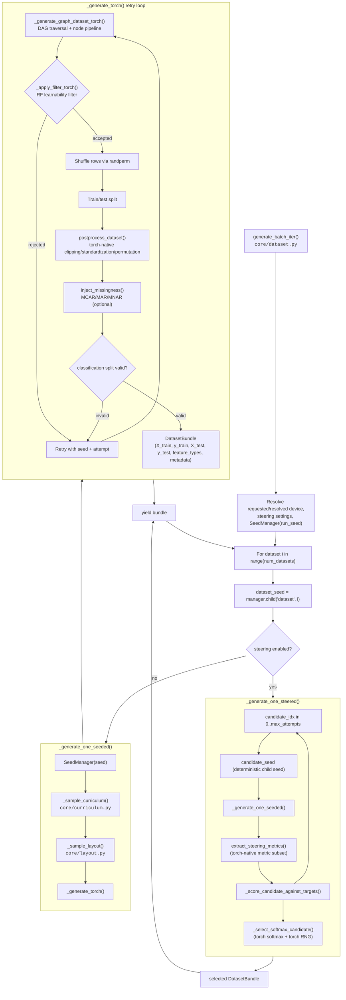
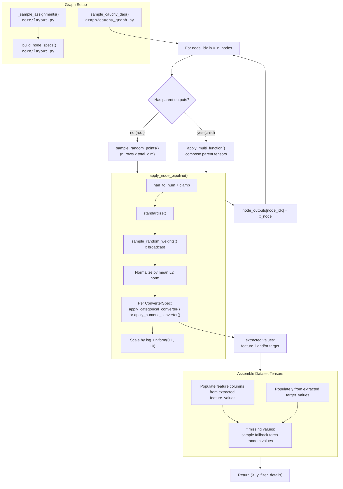
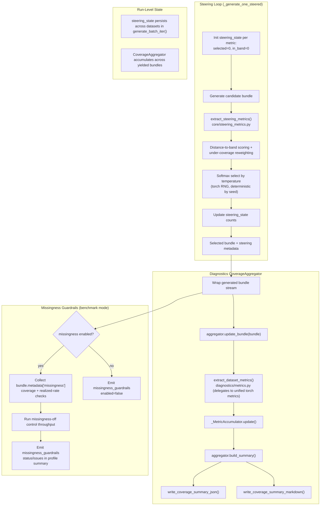

# Architecture Diagrams

Visual documentation of `cauchy-generator` control flow and data flow.

## Reading Guide

- Core generation is torch-native end-to-end (CPU/CUDA/MPS execution paths).
- Curriculum and stage resolution are handled in `core/curriculum.py`.
- Dataset layout and graph sampling are handled in `core/layout.py`.
- Steering candidate scoring uses torch-native metrics (`core/steering_metrics.py`).
- Diagnostics coverage extraction uses `diagnostics/metrics.py`, which normalizes bundles to CPU and delegates all mathematical metric computation to the unified torch-native steering metrics.

## 1. High-Level System Overview

CLI has three commands. `generate` and `benchmark` both apply hardware-aware tuning; `hardware` only inspects hardware.

### Context

- `generate` streams bundles; writing and diagnostics are stream consumers, not separate generation passes.
- Missingness injection is applied inside generation (postprocess boundary) when configured, and emitted in bundle metadata.
- `--no-write` keeps generation in memory while still allowing diagnostics artifact output when enabled.
- `benchmark` runs generation repeatedly through profile specs, can emit diagnostics per profile, and records missingness guardrail outcomes when missingness is enabled.
- `hardware` does not load `GeneratorConfig`.

## 2. Generation Pipeline Control Flow

Core runtime flow from `generate_batch_iter()` through seed derivation, curriculum/layout sampling, graph generation, postprocessing, and steering selection.

### Context

- Steering runs a bounded candidate loop per dataset, then selects one candidate probabilistically using deterministic seeded RNG.
- The main generation path is torch-native. Diagnostics extraction is separate from steering decisions.
- Retry behavior is inside `_generate_torch()` and applies to both steered and non-steered generation.
- Missingness injection happens after postprocess and before final bundle emission, with deterministic seed lineage.

## 3. DAG Node Data Flow

Data flow inside `_generate_graph_dataset_torch()`: root nodes sample base random points; child nodes transform parent outputs; node outputs are converted/extracted into final `X` and `y`.

### Context

- Node execution order follows DAG topological index order (`0..n_nodes-1` with upper-triangular adjacency).
- Parent-to-child flow is tensor-based and device-aware.
- Converters both transform node-local representation and emit extracted feature/target values used to assemble final dataset tensors.

## 4. Steering and Diagnostics Feedback Loops

Steering and diagnostics are related but distinct loops: steering influences candidate selection; diagnostics aggregates reporting metrics across emitted bundles.

### Context

- Steering metrics are a targeted subset optimized for selection-time performance.
- Diagnostics metrics are broader and reporting-focused; extraction runs on CPU-normalized bundles via torch-native metric computation.
- Steering and diagnostics can be enabled independently, though they are often used together.
- Missingness guardrails are benchmark-only and activate when missingness is enabled in the resolved profile config.
