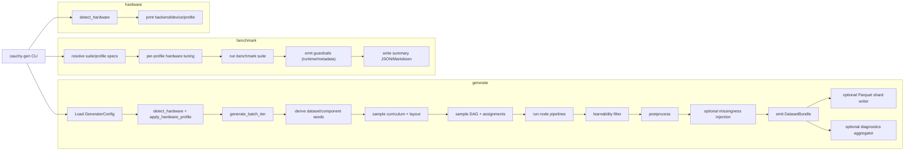
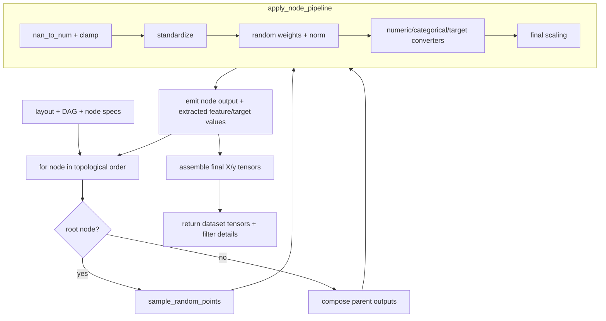

# How cauchy-generator Works

This guide explains how `cauchy-generator` works end-to-end and defines core
terms used across the repository.

This is the current baseline architecture. Function families, noise families,
and parameterizations can expand over time while keeping backward-compatible
default behavior.

## Who this is for

- End users who run `cauchy-gen generate` and `cauchy-gen benchmark`
- Contributors who need a fast mental model before reading implementation files

## Mental model in 90 seconds

`cauchy-generator` produces synthetic tabular datasets by sampling a causal DAG,
running random mechanisms over DAG nodes, converting node outputs into
features/targets, and applying quality/realism controls.

1. Load config and resolve hardware profile.
1. Derive deterministic seeds for each dataset and component.
1. Sample curriculum stage and dataset layout.
1. Sample a Cauchy DAG and node assignments.
1. Execute node pipelines in topological order to produce latent outputs.
1. Convert node outputs into observable `X` and `y`.
1. Apply filtering, postprocess transforms, and optional missingness injection.
1. Emit a `DatasetBundle`; optionally write shards and diagnostics artifacts.

## End-to-end flow

`cauchy-gen` has three commands:

- `generate`: produce datasets and optionally write artifacts.
- `benchmark`: run profile/suite workloads and report guardrails.
- `hardware`: inspect detected backend/device/profile.

## Generation pipeline walkthrough

### 1. Entry points and run-level setup

- `generate` flows through `src/cauchy_generator/cli.py` into generation
  helpers in `src/cauchy_generator/core/dataset.py`.
- A run-level seed initializes `SeedManager`, which derives deterministic child
  seeds (dataset-level and component-level).
- Hardware-aware defaults are applied before generation begins.

### 2. Layout and structure sampling

- `_sample_curriculum` (current baseline) picks stage constraints (or stage
  off/auto modes).
- `_sample_layout` decides row/feature/node/depth structure and feature/target
  assignment surfaces.
- `sample_cauchy_dag` builds an upper-triangular DAG with Cauchy-based edge
  logits.

### 3. Node execution and tensor assembly

- DAG nodes execute in topological index order.
- Root nodes sample base random points.
- Child nodes consume parent outputs via multi-parent composition.
- Each node applies a random mechanism family, then converter specs emit
  feature values and/or target values.
- Final `X`/`y` tensors are assembled from extracted values.

### 4. Quality gates and realism controls

- Learnability filter can reject weak-signal datasets and retry with new seeds.
- Postprocess standardizes/clips/permutes as configured.
- Missingness injection (MCAR/MAR/MNAR) is optional and applied after
  postprocess, before bundle emission.
- Shift/drift controls are optional and can bias graph density, mechanism-family
  sampling, and stochastic noise magnitudes.

### 4.5 Shift/drift controls

Shift controls are opt-in (`shift.enabled: true`). When disabled, generation
follows the baseline path unchanged.

The three shift axes use explicit scale semantics:

| Axis              | What changes                           | Scale mapping                                       |
| ----------------- | -------------------------------------- | --------------------------------------------------- |
| `graph_scale`     | DAG edge-density prior                 | `edge_logit_bias_shift = ln(2) * graph_scale`       |
| `mechanism_scale` | function-family sampling probabilities | `softmax(mechanism_scale * centered_family_logits)` |
| `noise_scale`     | stochastic noise magnitude             | `sigma_multiplier = exp((ln(2)/2) * noise_scale)`   |

Interpretation:

- `graph_scale = 1.0` doubles edge odds relative to baseline.
- `noise_scale = 1.0` corresponds to +3 dB variance (2x variance).
- `mechanism_scale > 0` shifts mass toward nonlinear families (`nn`, `tree`,
  `discretization`, `gp`, `product`) while remaining probabilistic.

### 5. Optional steering and diagnostics

- Steering (if enabled) generates multiple candidates per output slot,
  scores distance-to-target-band, and selects via temperature-scaled softmax.
- Diagnostics computes broader reporting metrics over emitted bundles and writes
  run-level summaries.

## DAG/node data flow

## Steering, diagnostics, and benchmark guardrails

Steering and diagnostics are related but distinct:

- Steering is selection-time logic inside generation.
- Diagnostics is reporting-time aggregation over emitted bundles.

Benchmark mode adds guardrails to detect runtime/metadata regressions and emits
sections such as `missingness_guardrails`, `lineage_guardrails`, and
`curriculum_guardrails` when relevant to the run.

## Glossary quick reference

### Graph and structure

- **DAG (directed acyclic graph)**: causal computation graph used to generate
  each dataset.
- **adjacency matrix**: binary parent-child matrix; upper triangle only.
- **topological order**: node order where every parent precedes its children.
- **edge logit bias**: global shift on edge logits controlling graph density.

### Pipeline and mechanisms

- **layout**: sampled dataset shape and feature/target-to-node assignments.
- **function family**: mechanism class applied at a node (current baseline
  includes neural network, tree ensemble, discretization, GP-rff, linear,
  quadratic, EM-style soft assignment, and product).
- **activation family**: nonlinearities used within mechanism families.
- **multi-function**: composition for multi-parent nodes (concatenate or
  per-parent transform + aggregate).
- **converter / ConverterSpec**: mapping from node latent slices to observable
  numeric/categorical features or targets.
- **numeric converter**: emits continuous values.
- **categorical converter**: emits integer class/category indices.
- **ODT (oblivious decision tree)**: tree variant used in the tree mechanism
  family.

### Complexity and quality

- **curriculum**: staged complexity controls over generated datasets.
- **curriculum stage**: fixed/auto/off mode and stage-specific complexity band.
- **stage bounds**: min/max constraints for features, nodes, and depth.
- **learnability filter**: random-forest-based gate for signal quality.
- **wins ratio**: bootstrap fraction where model beats baseline.
- **shift profile**: opt-in distribution-drift control over graph, mechanism,
  and noise sampling axes.

### Steering and metrics

- **steering**: candidate-based selection toward target meta-feature bands.
- **steering candidate**: one generated candidate competing for a single slot.
- **target band**: desired `[lo, hi]` interval for a metric plus weight.
- **softmax selection**: probabilistic candidate choice from scores.
- **temperature**: softmax sharpness control.
- **under-coverage reweighting**: increases weight for under-covered metrics.
- **meta-feature**: scalar dataset statistic used for reporting/steering.
- **linearity proxy / nonlinearity proxy / SNR proxy**: key steering metrics.

### Missingness

- **MCAR**: missingness independent of observed and unobserved values.
- **MAR**: missingness depends on observed values.
- **MNAR**: missingness depends on the value itself.
- **missingness mask**: binary mask indicating missing cells.

### Reproducibility

- **SeedManager**: deterministic seed derivation utility.
- **component path**: identifier sequence used to derive child seeds.
- **child seed**: derived seed for one dataset component.
- **seed derivation**: BLAKE2s-based mapping from parent seed + component path.

### Output and infrastructure

- **DatasetBundle**: in-memory output container (`X_train`, `y_train`,
  `X_test`, `y_test`, `feature_types`, `metadata`).
- **lineage artifact**: persisted DAG lineage payloads and adjacency references.
- **shard**: directory grouping multiple datasets and lineage artifacts.
- **hardware profile**: detected execution tier (`cpu`, `cuda_*`, etc.).

## Where to go next

- Output contract: [output-format.md](output-format.md)
- Design rationale and evolution policy: [design-decisions.md](design-decisions.md)
- End-user command workflows: [usage-guide.md](usage-guide.md)
- Mission-aligned roadmap and priorities: [roadmap.md](roadmap.md)
