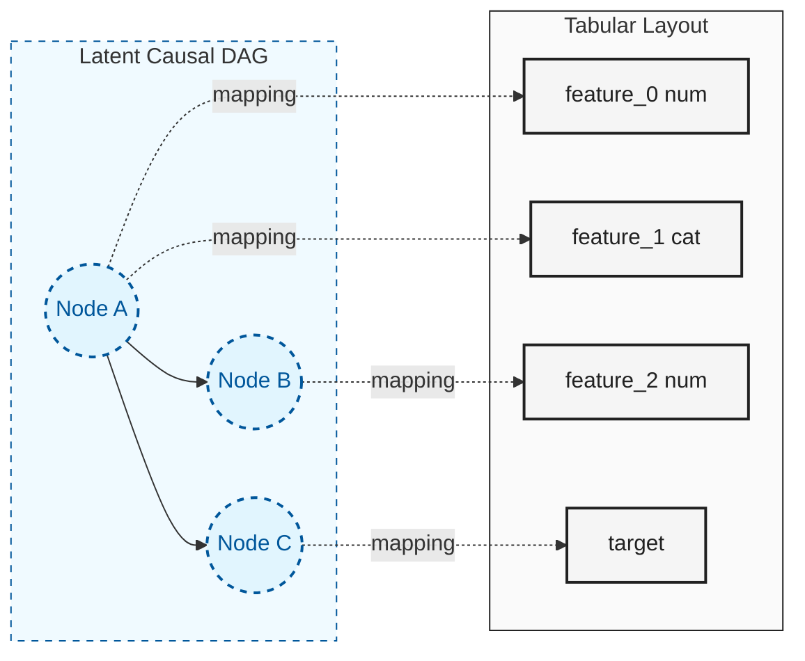
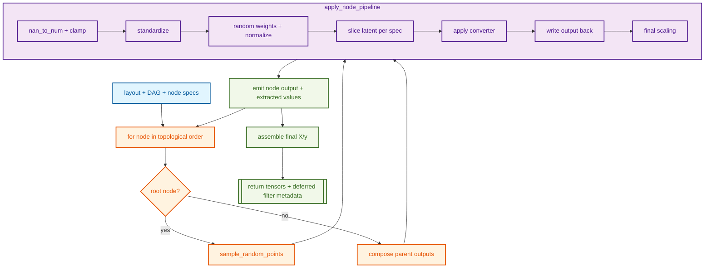

# How It Works {#how-dagzoo-works}

This guide explains `dagzoo` end-to-end with enough detail to reason
about behavior without needing to jump between many documents.

## Who this is for

- End users running `dagzoo generate` and `dagzoo benchmark`
- Contributors building a mental model before reading implementation
  files

## Mental model in 90 seconds

`dagzoo` synthesizes tabular datasets by sampling causal structure,
executing randomized mechanisms over that structure, and enforcing
quality and realism controls.

1. Resolve config and hardware context for the command.
1. Derive deterministic seeds for run, dataset, and component scopes.
1. Sample a dataset layout (feature types, assignments, graph size
   bounds).
1. Sample a DAG and node assignments.
1. Execute node pipelines in topological order to produce latent
   outputs.
1. Convert latent outputs into observable `X` and `y`.
1. Apply split checks, postprocess transforms, and optional
   missingness.
1. Emit `DatasetBundle` outputs; optionally persist shards and
   diagnostics.
1. Optionally run `dagzoo filter` as a deferred acceptance stage over
   shards.

## Core Concepts

### 1. Causal DAG vs tabular layout {#1-causal-dag-vs-tabular-layout}

The generation graph is a latent DAG, while emitted columns are a
tabular projection of that latent graph.

- Latent nodes represent abstract causal variables.
- Feature/target columns are assigned to nodes by sampled layout state.
- Multiple columns can map to one node, and one node can influence many
  columns.
- This decoupling allows rich causal interactions while preserving a
  clean acyclic execution graph.



### 2. Reproducibility tree {#2-reproducibility-tree}

Reproducibility is driven by `KeyedRng`, which maps one base seed onto
named semantic subtrees.

- One run seed fans out into deterministic run, dataset, layout, split,
  missingness, noise, and benchmark subtrees.
- Canonical bundle replay uses `seed` together with
  `dataset_index`/`run_num_datasets`, while exact internal subtree replay
  uses `metadata.keyed_replay`.
- `dataset_seed` remains a stable child-seed identifier for deferred
  filter and diagnostics compatibility; it is not the exact keyed runtime
  root.
- Changing one component path should not perturb unrelated component
  randomness.

Illustrative derivation chain:

```text
KeyedRng(run_seed)
  -> keyed("rows")
  -> keyed("plan_candidate", attempt, "layout")
  -> keyed("plan_candidate", attempt, "execution_plan")
  -> keyed("dataset", i, "noise_runtime")
  -> keyed("dataset", i, "attempt", attempt, "split")
  -> keyed("dataset", i, "attempt", attempt, "postprocess")
  -> keyed("dataset", i, "attempt", attempt, "missingness")
```

### 3. Split validity retries and deferred filter stage {#3-split-validity-retries-and-deferred-filter-stage}

Generation retries cover split-validity and generation exceptions only.

- Retries are bounded by `filter.max_attempts` (retry budget reused from
  config).
- Emitted metadata records `attempt_used` and generation-attempt
  counters.
- Generated outputs mark `metadata.filter.mode=deferred` and
  `metadata.filter.status=not_run`.

Data-quality acceptance is a separate stage:

- Run `dagzoo filter --in <shard_dir> --out <out_dir>`.
- Backend: CPU ExtraTrees-based wins-ratio filter.
- Replay config is taken from embedded shard metadata; artifacts without the
  required embedded metadata are rejected.
- Deferred runs emit acceptance/rejection artifacts and optional curated
  shards.

### 4. Effective config and traceability {#4-effective-config-and-traceability}

Generation and benchmark commands resolve effective config through
staged overrides, then validate constraints.

Generate path (high-level):

1. Base config YAML
1. Device override normalization
1. Hardware policy application
1. Missingness/diagnostics CLI overrides
1. Final generation constraint validation

Every run writes:

- `effective_config.yaml`
- `effective_config_trace.yaml`

The trace is field-level provenance (`path`, `source`, `old_value`,
`new_value`) for resolved settings.

### 5. Hardware-aware execution semantics {#5-hardware-aware-execution-semantics}

`dagzoo` tracks three related but distinct runtime notions:

- `requested_device`: normalized user intent (`auto`, `cpu`, `cuda`,
  `mps`)
- `resolved_device`: backend selected from request/environment
- `device`: backend used for dataset execution in that attempt

Notable runtime behavior:

- `auto` resolves to available accelerator first, else CPU.
- Backend runtime errors surface directly; generation does not rewrite the
  resolved device after execution starts.
- Split/postprocess control RNG runs on CPU to avoid tiny-op accelerator
  overhead.

## Mathematical Foundations

Formal equations are canonicalized in
[transforms.md](transforms.md).

- Canonical equations + implementation map:
  [transforms.md](transforms.md)
- Shared notation and symbol definitions:
  [transforms.md#notation-and-symbols](transforms.md#notation-and-symbols)

Quick index to the formal sections:

1. **DAG sampling**: strict upper-triangular Bernoulli sampling with
   Cauchy latent logits and shift-adjusted edge bias.
1. **Mechanism-family sampling**: family-mix weights plus mechanism
   logit tilt produce runtime family probabilities.
1. **Node pipeline**: root/parent composition, latent sanitization and
   weighting, converter slicing, and final scaling.
1. **Converters and noise**: numeric/categorical converter equations
   and dataset-level noise runtime selection (including mixture-mode
   behavior).

## End-to-end flow

This diagram shows command-level orchestration and where generation,
benchmarking, and hardware inspection diverge.

```mermaid
flowchart TB
    %% Class Definitions
    classDef cli fill:#e1f5fe,stroke:#01579b,stroke-width:2px,color:#01579b
    classDef gen fill:#fff3e0,stroke:#e65100,stroke-width:2px,color:#e65100
    classDef bench fill:#f3e5f5,stroke:#4a148c,stroke-width:2px,color:#4a148c
    classDef flt fill:#e8f5e9,stroke:#1b5e20,stroke-width:2px,color:#1b5e20
    classDef hw fill:#f1f8e9,stroke:#33691e,stroke-width:2px,color:#33691e

    CLI(["dagzoo CLI"])

    CLI --> GenCfg
    CLI --> BenchCfg
    CLI --> Detect

    subgraph GeneratePath [generate]
        direction TB
        subgraph Setup [" "]
            GenCfg[load + resolve config] --> Loop[generate_batch_iter]
            Loop --> Seed[derive dataset/component seeds]
        end
        subgraph Sampling [" "]
            Seed --> Layout[sample layout]
            Layout --> DAG[sample DAG + assignments]
            DAG --> Resolve[resolve shift + noise]
        end
        subgraph Execution [" "]
            Resolve --> Exec[run node pipelines]
        end
        subgraph Emission [" "]
            Exec --> Post[postprocess]
            Post --> Missing[optional missingness]
            Missing --> Bundle[[emit DatasetBundle]]
        end
    end

    subgraph FilterPath [filter]
        direction TB
        FilterCmd[dagzoo filter] --> Replay[replay ExtraTrees over shards]
        Replay --> FilterArtifacts[write manifest + summary (+ optional curated shards)]
    end
    Bundle --> FilterCmd

    subgraph BenchmarkPath [benchmark]
        direction TB
        BenchCfg[resolve preset/suite configs] --> Runs[run benchmark suite]
        Runs --> Guards[emit guardrails]
        Guards --> Reports[write summary]
    end

    subgraph HardwarePath [hardware]
        direction TB
        Detect[detect_hardware] --> Print[print backend/tier]
    end

    %% Assign Classes
    class CLI cli
    class GenCfg,Loop,Seed,Layout,DAG,Resolve,Exec,Post,Missing,Bundle gen
    class FilterCmd,Replay,FilterArtifacts flt
    class BenchCfg,Runs,Guards,Reports bench
    class Detect,Print hw

    style Setup fill:transparent,stroke:none
    style Sampling fill:transparent,stroke:none
    style Execution fill:transparent,stroke:none
    style Emission fill:transparent,stroke:none
```

## Generation pipeline walkthrough

This section maps the runtime to module boundaries and data flow.

### 1) Entry points and orchestration boundaries {#1-entry-points-and-orchestration-boundaries}

- Public generation APIs live in `src/dagzoo/core/dataset.py`.
- `dataset.py` is a façade over focused internals:
  - `generation_context.py`: seed/split/device/dtype helpers
  - `generation_runtime.py`: shared finalization, stratified split, and postprocess helpers
  - `noise_runtime.py`: per-dataset noise runtime selection
  - `fixed_layout_runtime.py`: internal canonical run preparation,
    classification replay validation, and batched execution orchestration
  - `fixed_layout.py`: shared fixed-layout metadata helpers and layout signatures

### 2) Layout and structure sampling {#2-layout-and-structure-sampling}

- `_sample_layout` samples feature counts/types, class bounds, and
  feature/target-to-node assignments.
- `sample_dag` samples strict upper-triangular adjacency.
- Adjacency convention is `adjacency[src, dst]`; parents of node `j` are
  read from column `adjacency[:, j]`.

### 3) Node execution and tensor assembly {#3-node-execution-and-tensor-assembly}

- Nodes execute in index/topological order.
- Root nodes sample latent points directly.
- Child nodes consume parent outputs using multi-parent composition:
  - 50% path: concatenate parents and apply one mechanism
  - 50% path: apply per-parent mechanisms, then aggregate via
    `sum | product | max | logsumexp`
- Converter specs slice latent columns and emit feature/target values.
- Unassigned feature slots are filled with sampled noise.

### 4) Quality, shift/noise controls, and postprocessing {#4-quality-shiftnoise-controls-and-postprocessing}

- Shift runtime params modulate graph/mechanism/noise behavior when
  enabled.
- Noise runtime resolution picks one family per dataset in mixture mode,
  then propagates through node-level samplers.
- Split, postprocess, and missingness run in-generation.
- Classification split validity is enforced before bundle emission.

Canonical postprocess behavior:

- Public generation preserves emitted schema across a canonical run.
- Classification runs may validate the requested run up front before the
  first bundle is emitted so later dataset seeds cannot fail after
  partial output.

### 5) Metadata and output emission {#5-metadata-and-output-emission}

Each bundle includes runtime metadata for lineage, deferred-filter
status, shift, noise distribution, and resolved config snapshot.

- `lineage` aligns emitted columns with DAG node assignments.
- `requested_device`, `resolved_device`, and the reserved
  `device_fallback_reason` field are emitted for runtime observability.
- Canonical generation outputs add `layout_mode`, `layout_plan_seed`,
  `layout_signature`, `dataset_seed`, and `keyed_replay`.

## DAG/node data flow

This diagram focuses on node-level execution mechanics inside the
canonical generation runtime.



## Diagnostics, fixed layout, and benchmark guardrails

These are related but distinct runtime surfaces.

- Canonical fixed-layout generation controls structural consistency
  across emitted datasets.
- Diagnostics aggregates observability metrics across emitted bundles.
- Benchmark guardrails evaluate runtime/metadata regressions in suite
  runs.

## Glossary quick reference

- **layout**: sampled feature/task/assignment scaffold for one dataset.
- **DAG adjacency**: upper-triangular parent-child matrix, `src -> dst`.
- **node pipeline**: per-node transform and converter execution path.
- **converter spec**: instruction for extracting observable
  feature/target slices.
- **deferred filter**: ExtraTrees-based post-generation gate for signal
  quality.
- **wins ratio**: bootstrap fraction where model beats baseline.
- **shift runtime params**: resolved graph/mechanism/noise drift
  controls.
- **noise runtime selection**: per-dataset resolved noise family/params.
- **fixed-layout plan**: internal sampled layout/execution payload reused
  within one canonical run.
- **layout signature**: deterministic hash fingerprint of a sampled
  layout.
- **DatasetBundle**: in-memory output container with tensors + metadata.
- **effective config trace**: field-level override provenance artifact.

## Where to go next

- Canonical transform equations and symbol definitions:
  `docs/transforms.md`
- Output schema and metadata contract: `docs/output-format.md`
- Config precedence and trace details:
  `docs/development/config-resolution.md`
- CLI workflow examples: `docs/usage-guide.md`
- Architecture rationale: `docs/development/design-decisions.md`
