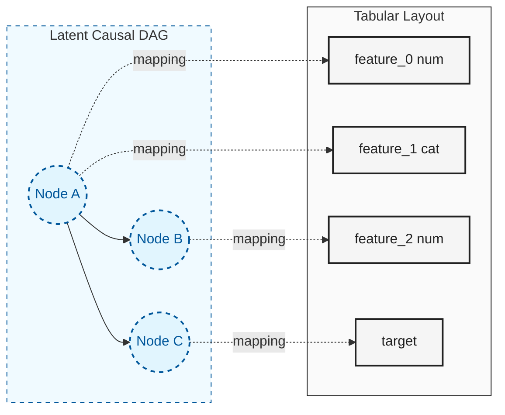
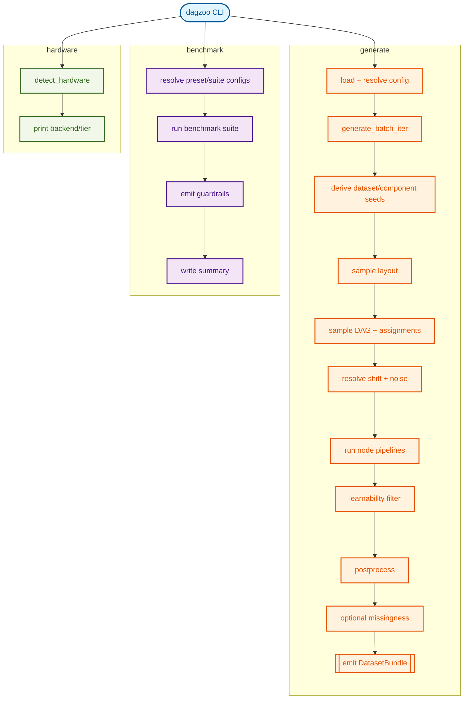
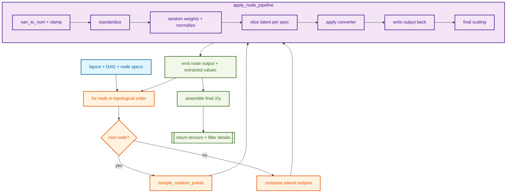

# How dagzoo Works

This guide explains `dagzoo` end-to-end with enough detail to reason about
behavior without needing to jump between many documents.

## Who this is for

- End users running `dagzoo generate` and `dagzoo benchmark`
- Contributors building a mental model before reading implementation files

## Mental model in 90 seconds

`dagzoo` synthesizes tabular datasets by sampling causal structure,
executing randomized mechanisms over that structure, and enforcing quality and
realism controls.

1. Resolve config and hardware context for the command.
1. Derive deterministic seeds for run, dataset, and component scopes.
1. Sample a dataset layout (feature types, assignments, graph size bounds).
1. Sample a DAG and node assignments.
1. Execute node pipelines in topological order to produce latent outputs.
1. Convert latent outputs into observable `X` and `y`.
1. Apply filter checks, postprocess transforms, and optional missingness.
1. Emit `DatasetBundle` outputs; optionally persist shards and diagnostics.

## Core Concepts

### 1. Causal DAG vs tabular layout

The generation graph is a latent DAG, while emitted columns are a tabular
projection of that latent graph.

- Latent nodes represent abstract causal variables.
- Feature/target columns are assigned to nodes by sampled layout state.
- Multiple columns can map to one node, and one node can influence many columns.
- This decoupling allows rich causal interactions while preserving a clean
  acyclic execution graph.



### 2. Reproducibility tree

Reproducibility is driven by deterministic seed derivation using `SeedManager`
and explicit offset helpers.

- One run seed fans out into deterministic dataset/component seeds.
- Layout sampling, node-spec derivation, split permutation, missingness masks,
  and noise-family selection use isolated RNG streams.
- Changing one component path should not perturb unrelated component randomness.

Illustrative derivation chain:

```text
run_seed -> child("dataset", i)
         -> child("data")
         -> attempt_seed(run_seed, attempt_idx)
         -> node_spec_seed(run_seed, node_idx)
         -> split_permutation_seed(run_seed, attempt_idx)
```

### 3. Data quality gate and retries

The optional filter enforces a minimum learnability threshold.

- Backend: CPU ExtraTrees-based wins-ratio filter.
- If a candidate fails filtering or split validity checks, generation retries.
- Retries are bounded by `filter.max_attempts`.
- Emitted metadata records acceptance details and `attempt_used`.

Operational implication: requesting N datasets may require more than N synthesis
attempts internally.

### 4. Effective config and traceability

Generation and benchmark commands resolve effective config through staged
overrides, then validate constraints.

Generate path (high-level):

1. Base config YAML
1. Device override normalization
1. Hardware policy application
1. Missingness/diagnostics CLI overrides
1. Final generation constraint validation

Every run writes:

- `effective_config.yaml`
- `effective_config_trace.yaml`

The trace is field-level provenance (`path`, `source`, `old_value`,
`new_value`) for resolved settings.

### 5. Hardware-aware execution semantics

`dagzoo` tracks three related but distinct runtime notions:

- `requested_device`: normalized user intent (`auto`, `cpu`, `cuda`, `mps`)
- `resolved_device`: backend selected from request/environment
- `device`: backend used for dataset execution in that attempt

Notable runtime behavior:

- `auto` resolves to available accelerator first, else CPU.
- `auto` + resolved `mps` has a guarded fallback path to CPU on runtime failure.
- Split/postprocess control RNG runs on CPU to avoid tiny-op accelerator overhead.

## Mathematical Foundations

Formal equations are canonicalized in [development/transforms.md](development/transforms.md).

- Canonical equations + implementation map: [development/transforms.md](development/transforms.md)
- Shared notation and symbol definitions: [development/transforms.md#notation-and-symbols](development/transforms.md#notation-and-symbols)

Quick index to the formal sections:

1. **DAG sampling**: strict upper-triangular Bernoulli sampling with Cauchy latent logits and shift-adjusted edge bias.
1. **Mechanism-family sampling**: family-mix weights plus mechanism logit tilt produce runtime family probabilities.
1. **Node pipeline**: root/parent composition, latent sanitization and weighting, converter slicing, and final scaling.
1. **Converters and noise**: numeric/categorical converter equations and dataset-level noise runtime selection (including mixture-mode behavior).

## End-to-end flow

This diagram shows command-level orchestration and where generation,
benchmarking, and hardware inspection diverge.



## Generation pipeline walkthrough

This section maps the runtime to module boundaries and data flow.

### 1) Entry points and orchestration boundaries

- Public generation APIs live in `src/dagzoo/core/dataset.py`.
- `dataset.py` is a façade over focused internals:
  - `generation_context.py`: seed/split/device/dtype helpers
  - `generation_engine.py`: torch generation loop and retries
  - `noise_runtime.py`: per-dataset noise runtime selection
  - `fixed_layout.py`: fixed-layout plan/compatibility execution

### 2) Layout and structure sampling

- `_sample_layout` samples feature counts/types, class bounds, and
  feature/target-to-node assignments.
- `sample_dag` samples strict upper-triangular adjacency.
- Adjacency convention is `adjacency[src, dst]`; parents of node `j` are read
  from column `adjacency[:, j]`.

### 3) Node execution and tensor assembly

- Nodes execute in index/topological order.
- Root nodes sample latent points directly.
- Child nodes consume parent outputs using multi-parent composition:
  - 50% path: concatenate parents and apply one mechanism
  - 50% path: apply per-parent mechanisms, then aggregate via
    `sum | product | max | logsumexp`
- Converter specs slice latent columns and emit feature/target values.
- Unassigned feature slots are filled with sampled noise.

### 4) Quality, shift/noise controls, and postprocessing

- Shift runtime params modulate graph/mechanism/noise behavior when enabled.
- Noise runtime resolution picks one family per dataset in mixture mode,
  then propagates through node-level samplers.
- Filter, split, postprocess, and missingness run in that order.
- Classification split validity is enforced before bundle emission.

Mode-specific postprocess behavior:

- Standard generation can remove constant columns and permute feature columns.
- Fixed-layout generation preserves emitted schema across the batch.

### 5) Metadata and output emission

Each bundle includes runtime metadata for lineage, filter outcomes, shift,
noise distribution, and resolved config snapshot.

- `lineage` aligns emitted columns with DAG node assignments.
- `requested_device`, `resolved_device`, and optional fallback reason are
  emitted for runtime observability.
- Fixed-layout batches add `layout_mode`, `layout_plan_seed`, and
  `layout_signature`.

## DAG/node data flow

This diagram focuses on node-level execution mechanics inside the generation
engine.



## Diagnostics, fixed layout, and benchmark guardrails

These are related but distinct runtime surfaces.

- Fixed-layout generation controls structural consistency across emitted datasets.
- Diagnostics aggregates observability metrics across emitted bundles.
- Benchmark guardrails evaluate runtime/metadata regressions in suite runs.

## Glossary quick reference

- **layout**: sampled feature/task/assignment scaffold for one dataset.
- **DAG adjacency**: upper-triangular parent-child matrix, `src -> dst`.
- **node pipeline**: per-node transform and converter execution path.
- **converter spec**: instruction for extracting observable feature/target slices.
- **learnability filter**: ExtraTrees-based gate for signal quality.
- **wins ratio**: bootstrap fraction where model beats baseline.
- **shift runtime params**: resolved graph/mechanism/noise drift controls.
- **noise runtime selection**: per-dataset resolved noise family/params.
- **fixed-layout plan**: reusable sampled layout with compatibility snapshot.
- **layout signature**: deterministic hash fingerprint of a sampled layout.
- **DatasetBundle**: in-memory output container with tensors + metadata.
- **effective config trace**: field-level override provenance artifact.

## Where to go next

- Canonical transform equations and symbol definitions: `docs/development/transforms.md`
- Output schema and metadata contract: `docs/output-format.md`
- Config precedence and trace details: `docs/config-resolution.md`
- CLI workflow examples: `docs/usage-guide.md`
- Architecture rationale: `docs/design-decisions.md`
